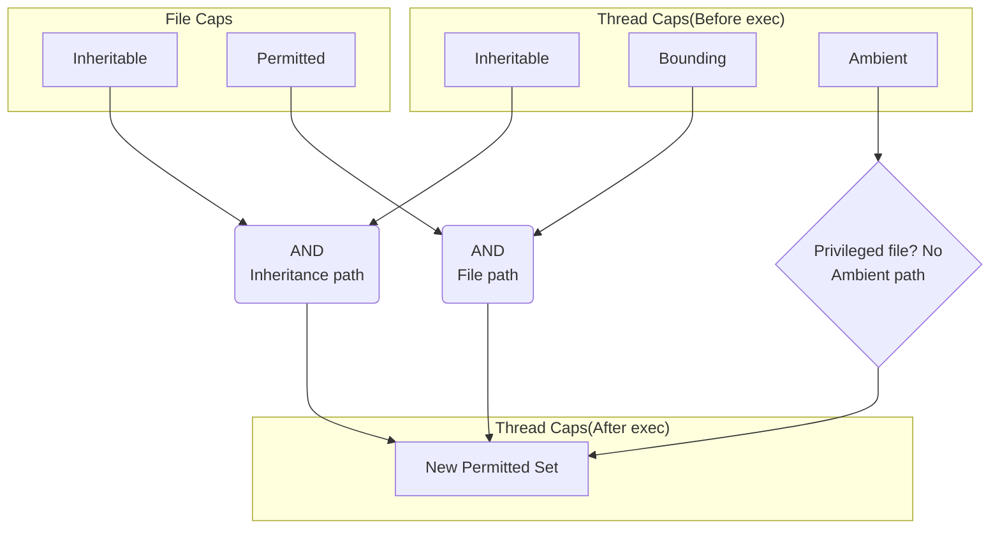



In Kubernetes and Docker, capabilities are often presented as a simple way to get fine-grained control over root privileges.
```yaml
securityContext:
  capabilities:
    drop: ["ALL"]
    add: ["NET_BIND_SERVICE"]
```

```console
$ docker run --cap-drop=ALL --cap-add=NET_BIND_SERVICE $image $cmd
```

But Linux (and the OCI Runtime Specification) defines multiple capability sets.
The details are easy to forget, so I'm writing them down here.

# Capability Assignment Targets

Capabilities can be assigned to two kinds of targets:

- File capabilities: Assigned to executable files. Applied to the calling thread during `execve(2)`
- Thread capabilities: Held by processes (threads). Used by the kernel for permission checks

## File capabilities

A mechanism for assigning capabilities to executable files themselves. Stored in the `security.capability` extended attribute (xattr).

| capability set | Description |
| --- | --- |
| Permitted | Capabilities added to the thread's Permitted set after `execve(2)` |
| Inheritable | ANDed with the thread's Inheritable set, then added to Permitted |
| Effective | A flag (0 or 1). If 1, all Permitted capabilities are copied to Effective after `execve(2)` |

## Thread capabilities

The set of capabilities held by a thread (process). The kernel primarily checks Effective for permission decisions, while Permitted acts as the upper bound for Effective.
Actual values can be checked via `/proc/<pid>/status` fields: `CapEff` / `CapPrm` / `CapInh` / `CapBnd` / `CapAmb`.

| capability set | Description |
| --- | --- |
| Effective | Currently active capabilities. Primarily referenced for kernel permission checks. |
| Permitted | Upper bound of capabilities the thread may assume. Effective set is a subset of Permitted. May be recalculated on `execve(2)`. |
| Inheritable | Material for passing capabilities across `execve(2)`. Does not grant permissions on its own. |
| Bounding | Upper bound of capabilities that can be newly acquired via `execve(2)`. Masks the paths where Permitted can increase, especially through file capabilities / setuid-root. |
| Ambient | Mechanism to maintain capabilities more easily after `execve(2)`. Cleared if the exec target is privileged (setuid or has file capabilities). |

## Capability Set Relationships

Conceptual image[^3]:

```
┌───────────────────────┐
│     Bounding (B)      │
│   ┌────────────────┐  │
│   │ Permitted (P)  │  │
│   │  ┌──────────┐  │  │
│   │  │ Effective│  │  │
│   │  │   (E)    │  │  │
│   │  └──────────┘  │  │
│   └────────────────┘  │
└───────────────────────┘
```
[^3]: This diagram represents the concept of "upper bounds for privilege acquisition" and does not mean that inclusion relationships like `Permitted ⊆ Bounding` always hold.

- Effective ⊆ Permitted
- Bounding: Ceiling on what can be added to Permitted via the **file path** (file capabilities / setuid-root) during `execve(2)`
- Ambient ⊆ (Permitted ∩ Inheritable)
    - It is cleared when executing privileged files


- Bounding does not directly mask the inheritance path (`Inheritable(Thread) & Inheritable(File)`)
- Raising Ambient requires that `SECBIT_NO_CAP_AMBIENT_RAISE` is not set


# Capability Recalculation on execve(2)

When `execve(2)` happens, capabilities are recalculated based on both the current thread state and any file capabilities. I'll leave the precise rules to the man page and focus on the intuition here.



```
  P'(ambient)     = (file is privileged) ? 0 : P(ambient)
  P'(permitted)   = (P(inheritable) & F(inheritable)) |
                    (F(permitted) & P(bounding)) | P'(ambient)
  P'(effective)   = F(effective) ? P'(permitted) : P'(ambient)
  P'(inheritable) = P(inheritable)    [i.e., unchanged]
  P'(bounding)    = P(bounding)       [i.e., unchanged]
where:
  P()    denotes the value of a thread capability set before the execve(2)
  P'()   denotes the value of a thread capability set after the execve(2)
  F()    denotes a file capability set
```


Let's understand the behavior with a small program that:
* Requires CAP_NET_BIND_SERVICE
* Tries to add CAP_NET_BIND_SERVICE to Effective
* Prints capabilities before binding the port



Running it directly fails because the process doesn't have `CAP_NET_BIND_SERVICE`.
```console {title="capset to Effective fails because CAP_NET_BIND_SERVICE is not in Permitted"}
$ go build -o port_bind showcaps_bind.go
$ ./port_bind
failed to set effective CAP_NET_BIND_SERVICE: capset: operation not permitted
```
```console {title="Even skipping the set, it fails due to insufficient capabilities"}
$ ./port_bind --no-set-eff
uid=1000 euid=1000  NoNewPrivs=0
CAP_NET_BIND_SERVICE: Eff=no Prm=no Bnd=yes Amb=no Inh=no
bind(81): FAIL permission denied
```

Since Permitted determines the upper bound of what's possible, we won't focus much on Effective here. In practice, you just need to raise Effective for the capabilities you intend to use.

After `execve(2)`, capabilities can enter the new Permitted set through three paths:
1. **Inheritance path**: Inheritable(Thread) && Inheritable(File)
2. **File path**: Bounding(Thread) && Permitted(File)
3. **Ambient path**: Ambient(Thread)
    - However, it is cleared when executing privileged files (those with setuid/setgid bits or file capabilities)



Let's verify this with commands.

- `setcap` / `getcap`: Included in libcap. Assigns and checks capabilities on files
- `capsh`: Included in libcap. Launches a shell while manipulating capabilities
- `setpriv`: Included in util-linux. Executes commands with modified privileges

If not available, install the `libcap` or `util-linux` packages.



**Inheritance path**

Both Inheritable(Thread) && Inheritable(File) are required.

```console {title="Assign to Inheritable(File)"}
$ sudo setcap 'cap_net_bind_service=+i' ./port_bind
$ getcap -v ./port_bind
./port_bind cap_net_bind_service=i
```
```console {title="Assign to Inheritable(Thread) and execute"}
$ sudo capsh --user=nobody \
  --inh=cap_net_bind_service \
  -- -c "$(pwd)/port_bind"
uid=65534 euid=65534  NoNewPrivs=0
CAP_NET_BIND_SERVICE: Eff=yes Prm=yes Bnd=yes Amb=no Inh=yes
bind(81): OK
```

**File path**

Both Bounding(Thread) && Permitted(File) are required.

```console {title="Assign to Permitted(File)"}
$ sudo setcap -r ./port_bind
$ sudo setcap 'cap_net_bind_service=+p' ./port_bind
$ getcap -v ./port_bind
./port_bind cap_net_bind_service=p
```
```console {title="Bounding(Thread) is granted by default, so execution succeeds"}
$ ./port_bind
uid=1000 euid=1000  NoNewPrivs=0
CAP_NET_BIND_SERVICE: Eff=yes Prm=yes Bnd=yes Amb=no Inh=no
bind(81): OK
```

**Ambient path**

If a capability is in Ambient(Thread), it is added to the post-exec Permitted set.

```console
$ sudo setcap -r ./port_bind
$ sudo capsh --user=nobody \
  --caps="cap_net_bind_service+p" \
  --inh=cap_net_bind_service \
  --addamb=cap_net_bind_service \
  -- -c "$(pwd)/port_bind"
uid=65534 euid=65534  NoNewPrivs=0
CAP_NET_BIND_SERVICE: Eff=yes Prm=yes Bnd=yes Amb=yes Inh=yes
bind(81): OK
```

However, Ambient is cleared when executing a privileged file.
```console {title="Execution succeeds but Amb=no"}
$ sudo setcap 'cap_net_bind_service=+p' ./port_bind
$ sudo capsh --user=nobody \
  --caps="cap_net_bind_service+p" \
  --inh=cap_net_bind_service \
  --addamb=cap_net_bind_service \
  -- -c "$(pwd)/port_bind"
uid=65534 euid=65534  NoNewPrivs=0
CAP_NET_BIND_SERVICE: Eff=yes Prm=yes Bnd=yes Amb=no Inh=yes
bind(81): OK
```

## no_new_privs

Among the paths above, the file path can be blocked with `no_new_privs`.
With `no_new_privs=1`, acquiring new privileges via `execve(2)` is prevented.

The capset failure here is because `CAP_NET_BIND_SERVICE` doesn't enter `Permitted`, so it can't be raised to `Effective`.

```console {title="Using the file path still results in insufficient permissions"}
$ sudo setcap -r ./port_bind
$ sudo setcap 'cap_net_bind_service=+p' ./port_bind
$ setpriv --no-new-privs ./port_bind
failed to set effective CAP_NET_BIND_SERVICE: capset: operation not permitted
$ setpriv --no-new-privs ./port_bind --no-set-eff
uid=1000 euid=1000  NoNewPrivs=1
CAP_NET_BIND_SERVICE: Eff=no Prm=no Bnd=yes Amb=no Inh=no
bind(81): FAIL permission denied
```

# Capabilities in Kubernetes

We've looked at how capability sets work. Now, what actually happens with the following manifest commonly seen in Kubernetes?
```yaml
securityContext:
  capabilities:
    drop: ["ALL"]
    add: ["NET_BIND_SERVICE"]
```

After reading this far, you can see that `drop` and `add` are a higher-level abstraction.
Which capability sets are actually manipulated depends on the CRI/runtime[^1].
[^1]: Depends on the container runtime and execution environment.

Common behaviors include:
- drop: ["ALL"]: Removes capabilities from Effective/Permitted/Bounding (and sometimes Inheritable)
- add: ["NET_BIND_SERVICE"]: Adds NET_BIND_SERVICE to Effective/Permitted/Bounding (and sometimes Inheritable)
- Ambient is generally not set in Kubernetes[^2]

If you're curious, check these inside the Pod (hexadecimal bitmasks):
```console
$ cat /proc/1/status | egrep 'Cap(Inh|Prm|Eff|Bnd|Amb)|NoNewPrivs'
```

[^2]: https://github.com/kubernetes/kubernetes/issues/56374

Another related setting is [allowPrivilegeEscalation](https://kubernetes.io/docs/tasks/configure-pod-container/security-context/#set-the-security-context-for-a-pod).
`allowPrivilegeEscalation: false` sets `no_new_privs=1`, preventing privilege acquisition via `execve(2)` through the "file path" (`setuid` / file capabilities).
```yaml
securityContext:
  allowPrivilegeEscalation: false
  capabilities:
    drop: ["ALL"]
```

However, if your entrypoint drops privileges with `setuid(2)` (e.g., `su-exec`), Effective/Permitted are dropped and things may not work as expected.
Ambient can work around this, but Kubernetes currently doesn't set it[^2].

# Summary

Capabilities are often explained as "fine-grained root privileges," but in practice the `execve(2)` recalculation rules and the interplay between file and thread capability sets make the behavior surprisingly subtle.
When I forget the details, I'll refer back to this post.
