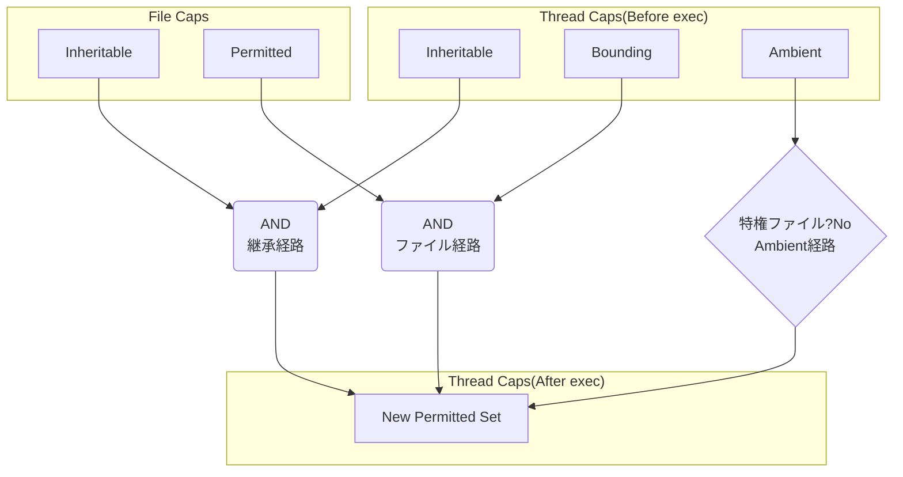

  

Kubernetes や Docker の世界では、Capabilities といえば root の権限を細かくするものとしてシンプルな世界になっている。
```yaml
securityContext:
  capabilities:
    drop: ["ALL"]
    add: ["NET_BIND_SERVICE"]
```

```console
$ docker run --cap-drop=ALL --cap-add=NET_BIND_SERVICE $image $cmd
```

以下のスライドでも紹介されているように、capability は root 権限を細分化するために使われる。



一方で、Linux や OCI Runtime Spec では capability set という概念がある。
こちらが難しくていつも忘れてしまうのでまとめておく。  

# Capability の付与対象

そもそも Capability には 2 つの付与対象がある:

- File capability: 実行ファイルに付与。`execve(2)` 時にスレッドの capability に反映される
- Thread capability: プロセス（スレッド）が持つ。カーネルが権限チェックに使う 

## File capability

実行ファイル自体に capability を付与する仕組み。拡張属性（xattr）の `security.capability` に格納される。

| capability set | 概要 |
| --- | --- |
| Permitted | `execve(2)` 後にスレッドの Permitted に追加される capability |
| Inheritable | スレッドの Inheritable と AND を取り、Permitted に追加される |
| Effective | フラグ（0 or 1）。1 の場合、`execve(2)` 後に Permitted が全て Effective にコピーされる |

## Thread capability

スレッド（プロセス）が保持している capability の集合。カーネルの権限チェックでは主に Effective が参照され、Permitted は Effective の上限として機能する。  
実際の値は `/proc/<pid>/status` の `CapEff` / `CapPrm` / `CapInh` / `CapBnd` / `CapAmb` で確認できる。

| capability set | 概要 |
| --- | --- |
| Effective | いま実際に有効な capability。カーネルの権限チェックで基本的に参照される。 |
| Permitted | 保持してよい capability の上限。有効セットは許可セットの部分集合。`execve(2)` で再計算され得る。 |
| Inheritable | `execve(2)` を跨いで capability を渡すための材料。単体で権限が有効になるものではない。 |
| Bounding | `execve(2)` により 新たに獲得し得る capability の上限。特に file capabilities / setuid-root などで許可セットが増える経路を上限でマスクする。 |
| Ambient | `execve(2)` 後も capability を維持しやすくする仕組み。`execve` 先が特権的（setuid や File capability 付き等）だとクリアされる。 |

## Capability set の関係

イメージ[^3]:

```
┌───────────────────────┐
│     Bounding (B)      │
│   ┌────────────────┐  │
│   │ Permitted (P)  │  │
│   │  ┌──────────┐  │  │
│   │  │ Effective│  │  │
│   │  │   (E)    │  │  │
│   │  └──────────┘  │  │
│   └────────────────┘  │
└───────────────────────┘
```
[^3]: この図は「権限獲得の上限」のイメージであり、`Permitted ⊆ Bounding` のような数学的な包含関係が常に成立するという意味ではない。

- Effective ⊆ Permitted
- Bounding: execve(2) の **ファイル経路**（file capability / setuid-root など）で Permitted を増やすときの天井
- Ambient ⊆ (Permitted ∩ Inheritable)
    - 特権的ファイルを exec するとクリア


- Bounding は継承経路（`Inheritable(Thread) & Inheritable(File)`）を直接マスクしない
- Ambient を raise するには `SECBIT_NO_CAP_AMBIENT_RAISE` で禁止されていないことが必要


# execve(2) での capability 再計算

execve(2) されるときに file capability とともに capability が再計算される。正確な説明は man に譲るとして、ここではお気持ちについて解説する。  



```
  P'(ambient)     = (file is privileged) ? 0 : P(ambient)
  P'(permitted)   = (P(inheritable) & F(inheritable)) |
                    (F(permitted) & P(bounding)) | P'(ambient)
  P'(effective)   = F(effective) ? P'(permitted) : P'(ambient)
  P'(inheritable) = P(inheritable)    [i.e., unchanged]
  P'(bounding)    = P(bounding)       [i.e., unchanged]
where:
  P()    denotes the value of a thread capability set before the execve(2)
  P'()   denotes the value of a thread capability set after the execve(2)
  F()    denotes a file capability set
```


以下のコードを題材に挙動を理解する。
* CAP_NET_BIND_SERVICE を必要とする
* CAP_NET_BIND_SERVICE を Effective に付与する
* Port をバインドする前に Capability を出力する



そのまま実行しても `CAP_NET_BIND_SERVICE` がないため実行できない。
```console {title="Permitted に CAP_NET_BIND_SERVICE がないため Effective への capset ができない"}
$ go build -o port_bind showcaps_bind.go 
$ ./port_bind
failed to set effective CAP_NET_BIND_SERVICE: capset: operation not permitted
```
```console {title="スキップをしても Capability が足りないので失敗する"}
$ ./port_bind --no-set-eff
uid=1000 euid=1000  NoNewPrivs=0
CAP_NET_BIND_SERVICE: Eff=no Prm=no Bnd=yes Amb=no Inh=no
bind(81): FAIL permission denied
```

まず、そもそもできることの上限は Permitted で決まるので、Effective についてはここではあまり触れない。実際のところ、必要に応じて付与すればよいだけである。

execve(2) 後の Permitted capability set に入ってくる可能性があるのは次の 3 経路：
1. **継承経路**: Inheritable(Thread) && Inheritable(File)
2. **ファイル経路**: Bounding(Thread) && Permitted(File)
3. **Ambient経路**: Ambient(Thread)
    - ただし特権的ファイル（setuid/setgid ビット付き、または file capability 付き）を exec するとクリアされる



ここからはコマンドで簡単に確認していきます。

- `setcap` / `getcap`: libcap に含まれる。ファイルに capability を付与・確認する
- `capsh`: libcap に含まれる。capability を操作しながらシェルを起動する
- `setpriv`: util-linux に含まれる。権限を変更してコマンドを実行する

手元に無ければ `libcap` や `util-linux` パッケージをインストールすると利用できる。



**継承経路**

Inheritable(Thread) && Inheritable(File) の両方が必要。

```console {title="Inheritable(File)に付与"}
$ sudo setcap 'cap_net_bind_service=+i' ./port_bind
$ getcap -v ./port_bind
./port_bind cap_net_bind_service=i
```
```console {title="Inheritable(Thread)に付与して実行する"}
$ sudo capsh --user=nobody \
  --inh=cap_net_bind_service \
  -- -c "$(pwd)/port_bind"
uid=65534 euid=65534  NoNewPrivs=0
CAP_NET_BIND_SERVICE: Eff=yes Prm=yes Bnd=yes Amb=no Inh=yes
bind(81): OK
```

**ファイル経路**

Bounding(Thread) && Permitted(File) の両方が必要。

```console {title="Permitted(File)に付与"}
$ sudo setcap -r ./port_bind
$ sudo setcap 'cap_net_bind_service=+p' ./port_bind
$ getcap -v ./port_bind
./port_bind cap_net_bind_service=p
```
```console {title="Bounding(Thread)はデフォルトで付与されているので実行可能"}
$ ./port_bind
uid=1000 euid=1000  NoNewPrivs=0
CAP_NET_BIND_SERVICE: Eff=yes Prm=yes Bnd=yes Amb=no Inh=no
bind(81): OK
```

**Ambient経路**

Ambient(Thread) があれば Permitted に入る。

```console
$ sudo setcap -r ./port_bind
$ sudo capsh --user=nobody \
  --caps="cap_net_bind_service+p" \
  --inh=cap_net_bind_service \
  --addamb=cap_net_bind_service \
  -- -c "$(pwd)/port_bind"
uid=65534 euid=65534  NoNewPrivs=0
CAP_NET_BIND_SERVICE: Eff=yes Prm=yes Bnd=yes Amb=yes Inh=yes
bind(81): OK
```

ただし、Ambient は特権的ファイルを exec するとクリアされる。
```console {title="実行はできるが、Amb=noになっている"}
$ sudo setcap 'cap_net_bind_service=+p' ./port_bind
$ sudo capsh --user=nobody \
  --caps="cap_net_bind_service+p" \
  --inh=cap_net_bind_service \
  --addamb=cap_net_bind_service \
  -- -c "$(pwd)/port_bind"
uid=65534 euid=65534  NoNewPrivs=0
CAP_NET_BIND_SERVICE: Eff=yes Prm=yes Bnd=yes Amb=no Inh=yes
bind(81): OK
```

## no_new_privs

上記の経路のうち、特にファイル経路は `no_new_privs` で制限できる。
`no_new_privs=1` では、execve(2) による新規の権限獲得が抑止される。

ここで capset が失敗しているのは、Permitted に CAP_NET_BIND_SERVICE が入らず Effective に持ち上げられないため。

```console {title="(2)ファイル経路を使っても権限不足となる"}
$ sudo setcap -r ./port_bind
$ sudo setcap 'cap_net_bind_service=+p' ./port_bind
$ setpriv --no-new-privs ./port_bind
failed to set effective CAP_NET_BIND_SERVICE: capset: operation not permitted
$ setpriv --no-new-privs ./port_bind --no-set-eff
uid=1000 euid=1000  NoNewPrivs=1
CAP_NET_BIND_SERVICE: Eff=no Prm=no Bnd=yes Amb=no Inh=no
bind(81): FAIL permission denied
```

# Kubernetes での capability

ここまでで capability set の仕組みを見てきた。では、Kubernetes でよく見る以下のマニフェストは実際にどうなっているのか。
```yaml
securityContext:
  capabilities:
    drop: ["ALL"]
    add: ["NET_BIND_SERVICE"]
```

ここまで読むと drop や add だけでは表現力としては抽象度を上げていることがわかると思う。
実際にどの capability set をどう操作するかは実行環境（CRI / ランタイム）に依存する[^1]。
[^1]: コンテナランタイムなど実行環境に依存する。

一般的には次のような挙動が多い:
- drop: ["ALL"]: Effective/Permitted/Bounding（＋場合によっては Inheritable）から capability を落とす
- add: ["NET_BIND_SERVICE"]: NET_BIND_SERVICE を Effective/Permitted/Bounding（＋場合によっては Inheritable）に追加する
- Ambient は Kubernetes では基本的にセットしない[^2]

気になる場合は Pod 内で次を見て確認すると早い（16進のビットマスク）。
```console
$ cat /proc/1/status | egrep 'Cap(Inh|Prm|Eff|Bnd|Amb)|NoNewPrivs'
```

[^2]: https://github.com/kubernetes/kubernetes/issues/56374

また、関連として [allowPrivilegeEscalation](https://kubernetes.io/docs/tasks/configure-pod-container/security-context/#set-the-security-context-for-a-pod) がある。
`allowPrivilegeEscalation: false` は `no_new_privs=1` をセットし、前述した「ファイル経路」（setuid / file capability など）による execve(2) 経由の権限獲得を抑止する。
```yaml
securityContext:
  allowPrivilegeEscalation: false
  capabilities:
    drop: ["ALL"]
```

ただし、コンテナ内で root→非root へ setuid する（su-exec 等）と Effective/Permitted が落ちて期待通り動かないケースがある。
Ambient を使えば回避できるが、Kubernetes は現状セットしない[^2]。

# まとめ

Capabilities は「root 権限を分割したもの」というシンプルな理解で始まりがちですが、実際には `execve(2)` を跨ぐ計算式や、File/Thread の属性の組み合わせによって複雑な挙動を示します。
また、忘れたら私もこの記事をきっと参照します。
