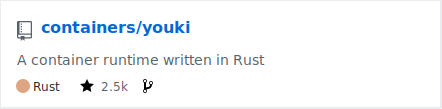

<div class="blankslate">
  <p class="my-12 h1 text-underline text-center text-mono"> Hello, youki! </p>
  <p>
  Hi, I'm Toru Komatsu(<a href="https://twitter.com/utam0k" target="_blank" rel="noopener noreferrer">@utam0k</a>), first committer of youki.<br> 
  This article was written in celebration of youki's v0.0.1 release
  </p>
<a href= "https://github.com/containers/youki/releases/tag/v0.0.1" target="_blank" rel="noopener noreferrer" class="btn-legacy btn-primary" type="button">View Relase Note</a>
</div>

## 🤔 What is youki?

Youki is a low level container runtime written in Rust that implements the [OCI Runtime Specification](https://github.com/opencontainers/runtime-spec/blob/main/spec.md). Simply put, youki is a commandline tool that can create containers. Other runtimes in the same category you might have heard about are [runc](https://github.com/opencontainers/runc) and [crun](https://github.com/containers/crun). When you create a container using Docker or Podman the actual container creation is delegated to a tool like youki.

<div class="my-4">
  <center>
  <a href="https://github.com/containers/youki"></a>
  </center>
</div>


## Why another container runtime?

Currently many container tools are implemented in Go which requires special handling when it comes to implementing a container runtime. Runc for example embeds a C program into its exectuable that handles setting up the namespaces as this is not possible in Go due to the multithreaded nature of the Go runtime. 

On the other hand C could be used as a implementation language but this comes at the cost of memory safety and in addition C lacks high level language constructs that we have come to expect from a modern language. 

Therefore while Go and C are perfectly fine languages, for this particular use case we believe that Rust with its cross section of low level control, memory safety and high level abstractions is uniquely suited for implementing a container runtime.

Youki has the potential to be faster and use less memory than runc, and therefore work in environments with tight memory usage requirements. Here is a simple benchmark of a container from creation to deletion. As with all benchmarks, this might not be representative of your own workloads

<center>

| Runtime |   Time (mean ± σ)   |  Range (min … max)  |
| :-----: | :-----------------: | :-----------------: |
|  youki  | 198.4 ms ±  52.1 ms | 97.2 ms … 296.1 ms  |
|  runc   | 352.3 ms ±  53.3 ms | 248.3 ms … 772.2 ms |
|  crun   | 153.5 ms ±  21.6 ms | 80.9 ms … 196.6 ms  |
</center>

<details>
<summary>Details about the benchmark</summary>

  - A command used for the benchmark  
      ```console
      $ hyperfine --prepare 'sudo sync; echo 3 | sudo tee /proc/sys/vm/drop_caches' --warmup 10 --min-runs 100 'sudo ./youki create -b tutorial a && sudo ./youki start a && sudo ./youki delete -f a'
      ```
  - Enviroment  
      ```console
      $ ./youki info
      Version           0.0.1
      Kernel-Release    5.11.0-41-generic
      Kernel-Version    #45-Ubuntu SMP Fri Nov 5 11:37:01 UTC 2021
      Architecture      x86_64
      Operating System  Ubuntu 21.04
      Cores             12
      Total Memory      32025
      Cgroup setup      hybrid
      Cgroup mounts
        blkio           /sys/fs/cgroup/blkio
        cpu             /sys/fs/cgroup/cpu,cpuacct
        cpuacct         /sys/fs/cgroup/cpu,cpuacct
        cpuset          /sys/fs/cgroup/cpuset
        devices         /sys/fs/cgroup/devices
        freezer         /sys/fs/cgroup/freezer
        hugetlb         /sys/fs/cgroup/hugetlb
        memory          /sys/fs/cgroup/memory
        net_cls         /sys/fs/cgroup/net_cls,net_prio
        net_prio        /sys/fs/cgroup/net_cls,net_prio
        perf_event      /sys/fs/cgroup/perf_event
        pids            /sys/fs/cgroup/pids
        unified         /sys/fs/cgroup/unified
      CGroup v2 controllers
        cpu             detached
        cpuset          detached
        hugetlb         detached
        io              detached
        memory          detached
        pids            detached
        device          attached
      Namespaces        enabled
        mount           enabled
        uts             enabled
        ipc             enabled
        user            enabled
        pid             enabled
        network         enabled
        cgroup          enabled
      $ ./youki --version
      youki version 0.0.1
      commit: 0.0.1-0-0be33bf
      $ runc -v
      runc version 1.0.0-rc93
      commit: 12644e614e25b05da6fd08a38ffa0cfe1903fdec
      spec: 1.0.2-dev
      go: go1.13.15
      libseccomp: 2.5.1
      $ crun --version
      crun version 0.19.1.45-4cc7
      commit: 4cc7fa1124cce75dc26e12186d9cbeabded2b710
      spec: 1.0.0
      +SYSTEMD +SELINUX +APPARMOR +CAP +SECCOMP +EBPF +CRIU +YAJL
      ```
</details>


## Implementation status

A container runtime needs to implement many features that users have come to expect from a container runtime, that have not yet been incorporated into the OCI Runtime Specification. Despite this being the first release of youki, many features have already been implemented.

|        Feature        |                   Description                   |                                                State                                                |
| :-------------------: | :---------------------------------------------: | :-------------------------------------------------------------------------------------------------: |
|        Docker         |               Running via Docker                |                                                 ✅                                                  |
|        Podman         |               Running via Podman                |                                                 ✅                                                  |
|      pivot_root       |            Change the root directory            |                                                 ✅                                                  |
|        Mounts         |    Mount files and directories to container     |                                                 ✅                                                  |
|      Namespaces       |         Isolation of various resources          |                                                 ✅                                                  |
|     Capabilities      |            Limiting root privileges             |                                                 ✅                                                  |
|      Cgroups v1       |            Resource limitations, etc            |                                                 ✅                                                  |
|      Cgroups v2       |             Improved version of v1              | Support is complete except for devices. WIP on [#78](https://github.com/containers/youki/issues/78) |
| Systemd cgroup driver |        Setting up a cgroup using systemd        |                                                 ✅                                                  |
|        Seccomp        |             Filtering system calls              |                                                 ✅                                                  |
|         Hooks         | Add custom processing during container creation |                                                 ✅                                                  |
|       Rootless        |   Running a container without root privileges   |                                                 ✅                                                  |
|    OCI Compliance     |        Compliance with OCI Runtime Spec         |                                 ✅ 50 out of 50 test cases passing                                  |

## How to get started

Download youki from [the release](https://github.com/containers/youki/releases/tag/v0.0.1) page and follow the [tutorial](https://github.com/containers/youki#tutorial).
See [the mdbook](https://containers.github.io/youki/) for more details.

## 💪 Motivation

Why do we keep implementing youki?

* Contribution to the container runtime community  
We are trying to provide as much of the crates used to make youki to the community. Currently we are providing [containers/oci-spec-rs](https://github.com/containers/oci-spec-rs) as a crate, separated from youki's main code. We have already crates available for [cgroups](https://github.com/containers/youki/tree/main/crates/libcgroups), [container creation](https://github.com/containers/youki/tree/main/crates/libcontainer), [seccomp](https://github.com/containers/youki/tree/main/crates/libseccomp) and [oci-cli parsing](https://github.com/containers/youki/tree/main/crates/liboci-cli) which will be released at a later point in time.

* Explore  
Youki does not provide any support for older kernels. By doing so, it has the potential to use new features such as `io_uring`, `clone3` and `webassembly`. 

* Fun
We have fun implementing this. In fact, this might be the most important part.

## 🤝 Join youki!

Youki is always looking for people who want to learn about container runtimes in Rust, and for your input.

- [Issues that allow people to post their opinions and ideas](https://github.com/containers/youki/issues/10)
- [Discord](https://discord.gg/zHnyXKSQFD)
- [@utam0k](https://twitter.com/utam0k)

We also have [good first issue](https://github.com/containers/youki/issues?q=is%3Aopen+is%3Aissue+label%3A%22good+first+issue%22) as the first way to participate in development.
If you cannot find a good first issue that fits you, please ask on Discord or Twitter.

## 👣 A short history of youki

<div class="TimelineItem">
  <div class="TimelineItem-badge color-bg-danger-emphasis color-fg-on-emphasis">
  <svg width="16" height="16" class="w-6 h-6" fill="none" stroke="currentColor" viewBox="0 0 24 24" xmlns="http://www.w3.org/2000/svg">
    <path stroke-linecap="round" stroke-linejoin="round" stroke-width="2" d="M12 6.253v13m0-13C10.832 5.477 9.246 5 7.5 5S4.168 5.477 3 6.253v13C4.168 18.477 5.754 18 7.5 18s3.332.477 4.5 1.253m0-13C13.168 5.477 14.754 5 16.5 5c1.747 0 3.332.477 4.5 1.253v13C19.832 18.477 18.247 18 16.5 18c-1.746 0-3.332.477-4.5 1.253"></path>
  </svg>    
  </div>
  <div class="TimelineItem-body">
    utam0k found <a href="https://www.amazon.co.jp/dp/4297118378">a book about Docker & Kubernetes</a> written by <a href="https://twitter.com/TokunagaKohei">Kohei Tokunaga</a> in Japanese
  </div>
</div>
<div class="TimelineItem">
  <div class="TimelineItem-badge color-bg-success-emphasis color-fg-on-emphasis">
      <svg class="octicon octicon-git-commit" viewBox="0 0 14 16" version="1.1" width="14" height="16" aria-hidden="true">
      <path fill-rule="evenodd" d="M10.86 7c-.45-1.72-2-3-3.86-3-1.86 0-3.41 1.28-3.86 3H0v2h3.14c.45 1.72 2 3 3.86 3 1.86 0 3.41-1.28 3.86-3H14V7h-3.14zM7 10.2c-1.22 0-2.2-.98-2.2-2.2 0-1.22.98-2.2 2.2-2.2 1.22 0 2.2.98 2.2 2.2 0 1.22-.98 2.2-2.2 2.2z"></path>
    </svg>
  </div>
  <div class="TimelineItem-body">
    Studied <a href="https://github.com/oracle/railcar">railcar</a> which is implemented by Oracle and already archived
  </div>
</div>
<div class="TimelineItem">
  <div class="TimelineItem-badge color-bg-accent-emphasis color-fg-on-emphasis">
    <svg weight="16" height="16" class="w-6 h-6" fill="none" stroke="currentColor" viewBox="0 0 24 24" xmlns="http://www.w3.org/2000/svg"><path stroke-linecap="round" stroke-linejoin="round" stroke-width="2" d="M5 3v4M3 5h4M6 17v4m-2-2h4m5-16l2.286 6.857L21 12l-5.714 2.143L13 21l-2.286-6.857L5 12l5.714-2.143L13 3z"></path></svg>
  </div>
  <div class="TimelineItem-body">
    Started implementing the container runtime in Rust, which later became youki
  </div>
</div>
<div class="TimelineItem">
  <div class="TimelineItem-badge color-bg-success-emphasis color-fg-on-emphasis">
    <svg weight="16" height="16" class="w-6 h-6" fill="none" stroke="currentColor" viewBox="0 0 24 24" xmlns="http://www.w3.org/2000/svg"><path stroke-linecap="round" stroke-linejoin="round" stroke-width="2" d="M8.684 13.342C8.886 12.938 9 12.482 9 12c0-.482-.114-.938-.316-1.342m0 2.684a3 3 0 110-2.684m0 2.684l6.632 3.316m-6.632-6l6.632-3.316m0 0a3 3 0 105.367-2.684 3 3 0 00-5.367 2.684zm0 9.316a3 3 0 105.368 2.684 3 3 0 00-5.368-2.684z"></path></svg>
  </div>
  <div class="TimelineItem-body">
     Attracted attention of developers on <a href="https://www.reddit.com/r/programming/comments/niv8cg/youki_a_container_runtime_in_rust_passed_all_the/">Reddit</a> and elsewhere
  </div>
</div>
<div class="TimelineItem">
  <div class="TimelineItem-badge color-bg-success-emphasis color-fg-on-emphasis">
    <svg weight="16" height="16" class="w-6 h-6" fill="none" stroke="currentColor" viewBox="0 0 24 24" xmlns="http://www.w3.org/2000/svg"><path d="M9 17a2 2 0 11-4 0 2 2 0 014 0zM19 17a2 2 0 11-4 0 2 2 0 014 0z"></path><path stroke-linecap="round" stroke-linejoin="round" stroke-width="2" d="M13 16V6a1 1 0 00-1-1H4a1 1 0 00-1 1v10a1 1 0 001 1h1m8-1a1 1 0 01-1 1H9m4-1V8a1 1 0 011-1h2.586a1 1 0 01.707.293l3.414 3.414a1 1 0 01.293.707V16a1 1 0 01-1 1h-1m-6-1a1 1 0 001 1h1M5 17a2 2 0 104 0m-4 0a2 2 0 114 0m6 0a2 2 0 104 0m-4 0a2 2 0 114 0"></path></svg>
  </div>
  <div class="TimelineItem-body">
    Transfer from utam0k's personal account to the containers organization
    <blockquote class="twitter-tweet"><p lang="en" dir="ltr">🎉 I joined the containers organization, which is developing podman and crun. And I moved youki under containers.<a href="https://t.co/dMTFxrZKUZ">https://t.co/dMTFxrZKUZ</a> <a href="https://t.co/qx2nnvyvxw">pic.twitter.com/qx2nnvyvxw</a></p>&mdash; utam0k (@utam0k) <a href="https://twitter.com/utam0k/status/1400763774995374085?ref_src=twsrc%5Etfw">June 4, 2021</a></blockquote> <script async src="https://platform.twitter.com/widgets.js" charset="utf-8"></script>
  </div>
</div>
<div class="TimelineItem">
  <div class="TimelineItem-badge color-bg-success-emphasis color-fg-on-emphasis">
    <svg weight="16" height="16" class="w-6 h-6" fill="none" stroke="currentColor" viewBox="0 0 24 24" xmlns="http://www.w3.org/2000/svg"><path stroke-linecap="round" stroke-linejoin="round" stroke-width="2" d="M18 9v3m0 0v3m0-3h3m-3 0h-3m-2-5a4 4 0 11-8 0 4 4 0 018 0zM3 20a6 6 0 0112 0v1H3v-1z"></path></svg>
  </div>
  <div class="TimelineItem-body">
    More attention, more developers
  </div>
</div>
<div class="TimelineItem">
  <div class="TimelineItem-badge color-bg-success-emphasis color-fg-on-emphasis">
    <svg weight="16" height="16" class="w-6 h-6" fill="none" stroke="currentColor" viewBox="0 0 24 24" xmlns="http://www.w3.org/2000/svg"><path stroke-linecap="round" stroke-linejoin="round" stroke-width="2" d="M5 3v4M3 5h4M6 17v4m-2-2h4m5-16l2.286 6.857L21 12l-5.714 2.143L13 21l-2.286-6.857L5 12l5.714-2.143L13 3z"></path></svg>
  </div>
  <div class="TimelineItem-body">
    First release of youki
  </div>
</div>

## 🥰 Acknowledgement
Thanks to all the wonderful collaborators.  
[Thomas Schubart](https://github.com/Furisto), [yihuaf](https://github.com/yihuaf), [YJDoc2](https://github.com/YJDoc2), [tommady](https://github.com/tommady), [Yukang](https://github.com/chenyukang) and [Travis Sturzl](https://github.com/tsturzl) 

Thanks to the members of [containers](https://github.com/containers) for their cooperation.  
Thank you especially to [Sascha Grunert](https://github.com/saschagrunert), [Giuseppe Scrivano](https://github.com/giuseppe) and [Daniel J Walsh](https://github.com/rhatdan).

Thanks to all the people who already contributed!  
{}

This article has been reviewed by [Thomas Schubart](https://github.com/Furisto) and some additions have been made. Thank you very much.

## 💬 Conclusion

We are always eager for new contributers.
We don't have a sponsor feature on GitHub, so please give us a star to encourage us.
<script async defer src="https://buttons.github.io/buttons.js"></script>
<center>
<a class="github-button" target="_blank" rel="noopener noreferrer" href="https://github.com/containers/youki" data-color-scheme="no-preference: light; light: light; dark: dark;" data-size="large" data-show-count="true" aria-label="Star containers/youki on GitHub">Star</a>
</center>

[^1]: The OCI container runtime in this article refers to the type of OCI container runtime that uses namespace, etc., rather than the VM type.
